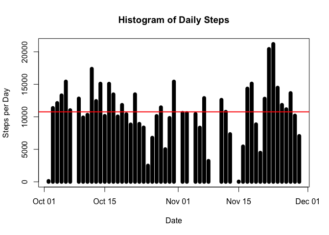
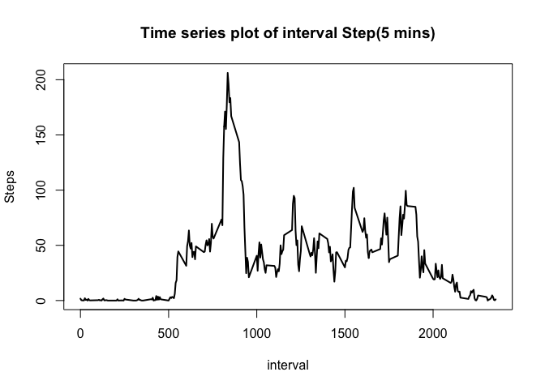
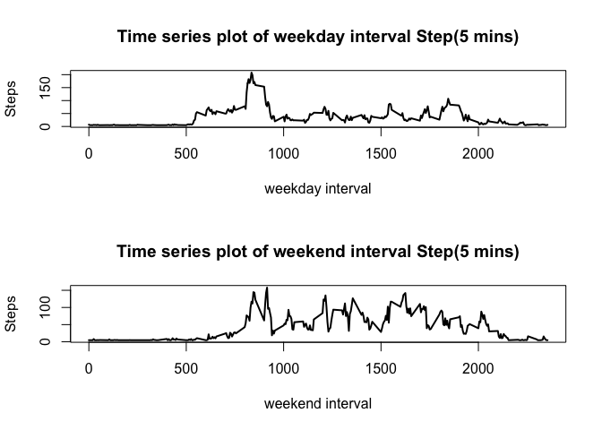

# Reproducible Research: Peer Assessment 1


## Loading and preprocessing the data
Load csv data **activity.csv** and convert dates to **R Date class**  

```r
# load the data
repData <- read.csv("activity.csv")

#convert the date to date class
repData$date <- as.Date(repData$date, "%Y-%m-%d")


aggregate_steps <- aggregate(steps~date,data = repData, sum)
```


## What is mean total number of steps taken per day?

```r
mean(aggregate_steps$steps)
```

```
## [1] 10766.19
```

## What is the average daily activity pattern?

```r
par(mfrow=c(1,1))
#histogram
plot(aggregate_steps$date, aggregate_steps$steps, type="h", 
     main="Histogram of Daily Steps", xlab="Date", ylab="Steps per Day", 
     col="black", lwd=8)

# draw the mean on histogram
abline(h=mean(aggregate_steps$steps), col="red", lwd=2)
```

<!-- -->

```r
fivemin_interval_steps <- aggregate(steps~interval,data = repData, mean)

par(mfrow=c(1,1))
plot(steps~interval,data =  fivemin_interval_steps, type = "l",
     main="Time series plot of interval Step(5 mins)", xlab="interval", ylab="Steps", 
     col="black", lwd=2)
```

<!-- -->

```r
fivemin_interval_steps[which.max(fivemin_interval_steps$steps),]$interval
```

```
## [1] 835
```


## Imputing missing values

```r
#find the mean of all steps
steps_mean <- mean(repData$steps, na.rm = T)

na_StepIndex <- which(is.na(repData$steps))

#apply the mean to NA values
repData[na_StepIndex,1] = steps_mean
```

## Are there differences in activity patterns between weekdays and weekends?

```r
repData$day <- weekdays(repData$date)

repData$day <- as.factor(ifelse(repData$day == "Saturday" | repData$day == "Sunday", 
                                "weekend", "weekday"))

steps_mean <- mean(repData$steps, na.rm = T)

na_StepIndex <- which(is.na(repData$steps))

repData[na_StepIndex,1] = steps_mean

fivemin_interval_steps_weekday <- aggregate(steps~interval,
                                data = repData[repData$day == "weekday",], mean)
fivemin_interval_steps_weekend <- aggregate(steps~interval,
                                data = repData[repData$day == "weekend",], mean)

par(mfrow=c(2,1))
plot(steps~interval,data =  fivemin_interval_steps_weekday, type = "l",
     main="Time series plot of weekday interval Step(5 mins)", xlab="weekday interval", ylab="Steps", 
     col="black", lwd=2)
plot(steps~interval,data =  fivemin_interval_steps_weekend, type = "l",
     main="Time series plot of weekend interval Step(5 mins)", xlab="weekend interval", ylab="Steps", 
     col="black", lwd=2)
```

<!-- -->
